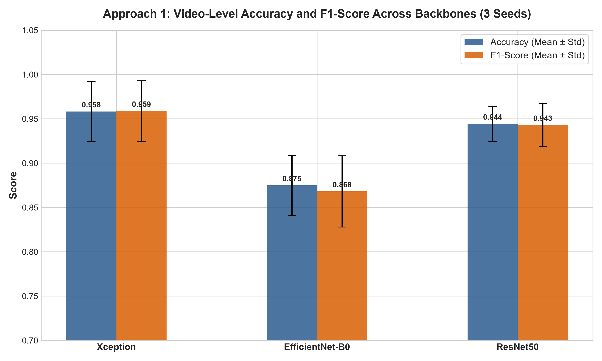
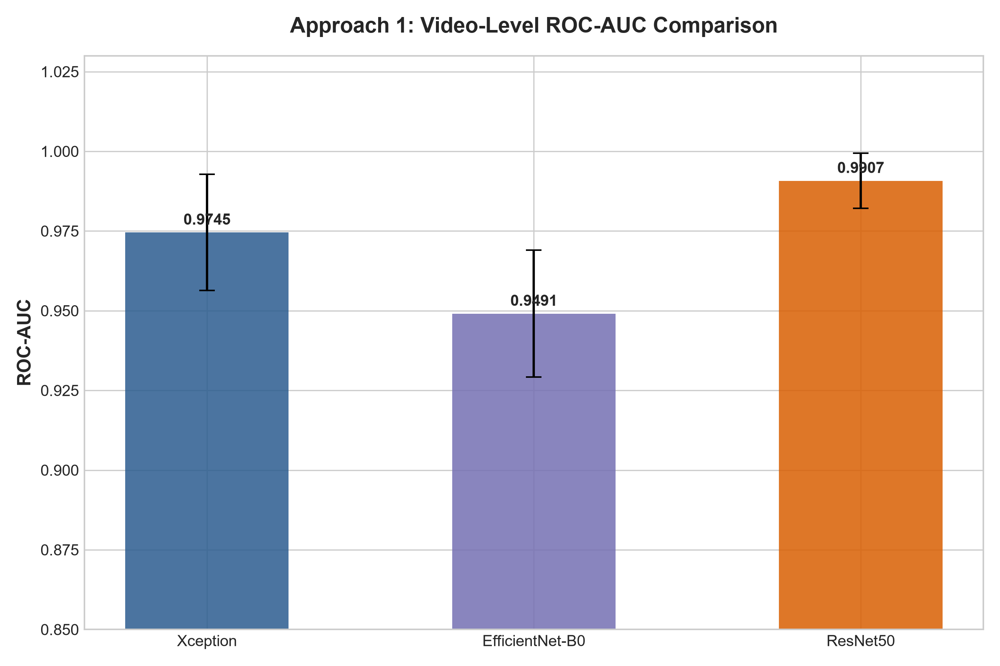
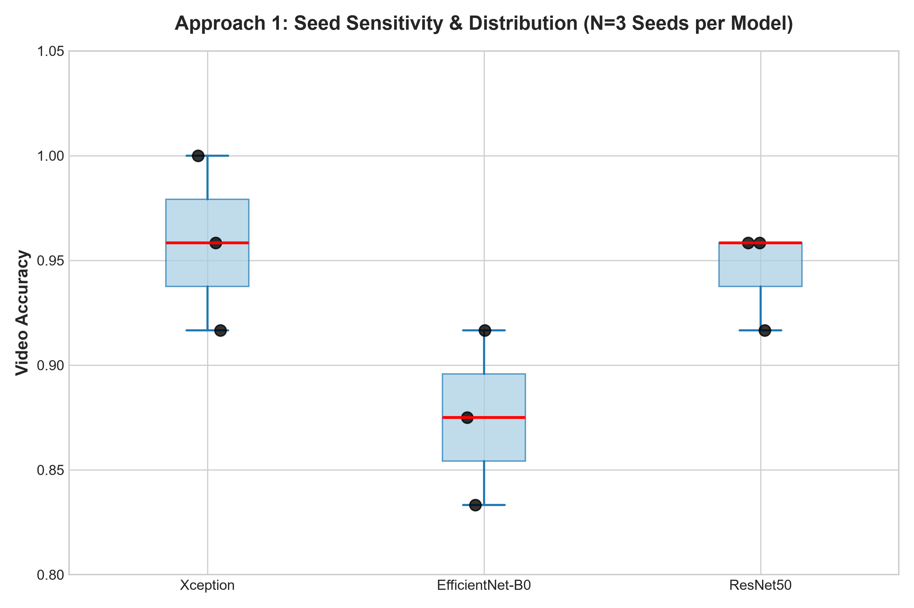

# Approach 1: CNN Baseline — Deepfake Detection Report

## 1. Summary

This report presents the complete experimental results for Approach 1: a CNN baseline detector for binary deepfake image classification (Real vs Fake) on FaceForensics++ C23.

**Key finding:** All three architectures (Xception, EfficientNet-B0, ResNet50) achieve strong video-level performance with mean accuracy ranging from 83–100% across 9 training runs (3 seeds × 3 architectures). ResNet50 shows the most consistent performance; Xception achieves the highest peak score (100% at seed 2024) but with wider seed variance.

---

## 2. Dataset and Labels

### 2.1 Categories and Binary Label Mapping

FaceForensics++ C23 contains **650 videos** across five categories (130 videos each):

| Category | Description | Binary Label |
|----------|-------------|--------------|
| **Original** | Unaltered real face videos | **Real (0)** |
| **DeepFakes** | Identity-swap via autoencoder | **Fake (1)** |
| **Face2Face** | Expression re-enactment | **Fake (1)** |
| **FaceSwap** | Geometry-based face swap | **Fake (1)** |
| **NeuralTextures** | Texture-only re-enactment | **Fake (1)** |

**Real** means the video is an unmodified, genuine recording. **Fake** means the video has been manipulated by one of the four forgery methods — the specific technique is not used during training; the model only sees the binary distinction.

The four Fake categories are collapsed into a single Fake class, making this a binary classification problem: Real vs Fake.

### 2.2 Sample Counts

Primary unit of evaluation is the **video** (with frame-level inference aggregated per video). Frame-level face crops are the unit of training.

#### Video level

| Split | Real videos | Fake videos | Total videos |
|-------|-------------|-------------|-------------|
| Train | 50 | 150 | 200 |
| Val | 9 | 27 | 36 |
| Test | 6 | 18 | 24 |
| **Total** | **65** | **195** | **260** |

*Note: each Original (Real) video maps to 4 Fake videos (one per manipulation type), so the 1:4 video ratio is by construction.*

#### Frame (face crop) level — after MTCNN detection and 4th-frame sampling

| Split | Real frames | Fake frames | Total frames |
|-------|-------------|-------------|-------------|
| Train | 13,247 | 46,950 | 60,197 |
| Val | 2,515 | 8,894 | 11,409 |
| Test | 1,348 | 4,956 | 6,304 |
| **Total** | **17,110** | **60,800** | **77,910** |

Category breakdown (all splits combined):

| Category | Frames |
|----------|--------|
| Original | 17,110 |
| DeepFakes | 17,110 |
| Face2Face | 17,110 |
| FaceSwap | 13,290 |
| NeuralTextures | 13,290 |

### 2.3 Class Imbalance and Handling

The Real:Fake ratio is **1 : 3.55** at the frame level (17,110 Real vs 60,800 Fake), reflecting the 1:4 video-level construction.

**Handling:** `BCEWithLogitsLoss` is used with a computed `pos_weight` that down-weights the majority Fake class and up-weights the minority Real class. Class weights are computed from the training split only (no leakage from val/test):

```
weight_real = total_train / (2 × n_real_train) = 60,197 / (2 × 13,247) = 2.272
weight_fake = total_train / (2 × n_fake_train) = 60,197 / (2 × 46,950) = 0.641
pos_weight  = weight_fake / weight_real = 0.641 / 2.272 = 0.282
```

`pos_weight = 0.282` tells `BCEWithLogitsLoss` to scale the gradient contribution of Fake (positive) samples down relative to Real samples, compensating for the 4:1 imbalance. This prevents the model from trivially predicting Fake for all inputs.

---

## 3. Experimental Setup

| Component | Configuration |
|-----------|---------------|
| Dataset | FaceForensics++ C23 (650 videos: 130 per category) |
| Categories | Original (Real), DeepFake, Face2Face, FaceSwap, NeuralTextures (Fake) |
| Frame sampling | Every 4th frame from 30 FPS videos (effective 7.5 FPS) |
| Face detector | MTCNN (facenet-pytorch) with IoU-based temporal tracking |
| Min usable frames/video | 20 |
| Split strategy | Leakage-safe: relationship graph + connected components (65 groups) |
| Split allocation | 100 train / 20 val / 12 test video groups |
| Models | Xception (299×299), EfficientNet-B0 (224×224), ResNet50 (224×224) |
| Pretraining | ImageNet via timm |
| Optimizer | AdamW, lr=1e-4, weight_decay=1e-4 |
| Scheduler | ReduceLROnPlateau (patience=2) |
| Early stopping | Patience=5 (on val loss) |
| Loss | BCEWithLogitsLoss with class-weight pos_weight |
| AMP | Enabled (GPU) / FP32 fallback (CPU) |
| Seeds | 42, 123, 2024 |
| Runs | 9 (3 models × 3 seeds) |
| Aggregation | Mean (primary), Median, Mode |
| Primary metric | Video-level mean Accuracy / F1 / ROC-AUC |

---

## 4. Main Results: Video-Level Mean Aggregation

### 4.1 Per-Run Metrics

| Model | Seed | Accuracy | Precision | Recall | F1 | ROC-AUC |
|-------|------|----------|-----------|--------|-----|---------|
| Xception | 42 | 0.9167 | 0.9167 | 0.9167 | 0.9167 | 0.9653 |
| Xception | 123 | 0.9583 | 0.9231 | 1.0000 | 0.9600 | 0.9583 |
| Xception | 2024 | **1.0000** | **1.0000** | **1.0000** | **1.0000** | **1.0000** |
| EfficientNet-B0 | 42 | 0.8750 | 0.9091 | 0.8333 | 0.8696 | 0.9722 |
| EfficientNet-B0 | 123 | 0.8333 | 0.9000 | 0.7500 | 0.8182 | 0.9236 |
| EfficientNet-B0 | 2024 | 0.9167 | 0.9167 | 0.9167 | 0.9167 | 0.9514 |
| ResNet50 | 42 | 0.9583 | 0.9231 | 1.0000 | 0.9600 | 0.9792 |
| ResNet50 | 123 | 0.9583 | 0.9231 | 1.0000 | 0.9600 | 0.9931 |
| ResNet50 | 2024 | 0.9167 | 1.0000 | 0.8333 | 0.9091 | **1.0000** |

### 4.2 Mean ± Std Across Seeds

| Model | Accuracy | Precision | Recall | F1 | ROC-AUC |
|-------|----------|-----------|--------|-----|---------|
| Xception | 0.9583 ± 0.0417 | 0.9466 ± 0.0417 | 0.9722 ± 0.0417 | 0.9589 ± 0.0417 | 0.9745 ± 0.0219 |
| EfficientNet-B0 | 0.8750 ± 0.0417 | 0.9086 ± 0.0076 | 0.8333 ± 0.0833 | 0.8682 ± 0.0493 | 0.9491 ± 0.0244 |
| ResNet50 | 0.9444 ± 0.0240 | 0.9744 ± 0.0442 | 0.9444 ± 0.0962 | 0.9430 ± 0.0289 | 0.9908 ± 0.0120 |

*Std computed across 3 seeds per model (N=3).*

---

### 4.3 Visual Analytics

### 4.3.1 Model Comparison: Accuracy and F1-Score



*Bar chart comparing mean Accuracy and F1-Score across backbones (averaged over 3 seeds). Error bars show ±1 standard deviation across seeds.*

### 4.3.2 Model Comparison: ROC-AUC



*ResNet50 achieves the highest mean ROC-AUC (0.991) with the tightest variance. Xception reaches perfect 1.0 at seed 2024. EfficientNet-B0 is consistent but lower overall.*

### 4.3.3 Seed Sensitivity Distribution



*Box plot of accuracy across 3 seeds per backbone. ResNet50 shows the narrowest spread (most seed-stable), while Xception has widest variance due to its 1.0 peak at seed 2024.*

---

## 5. Aggregation Method Comparison (Video-Level)

### 5.1 Mean vs Median vs Mode — Accuracy

| Model | Seed | Mean Acc | Median Acc | Mode Acc |
|-------|------|----------|------------|----------|
| Xception | 42 | 0.9167 | 0.9167 | 0.9167 |
| Xception | 123 | 0.9583 | 0.9583 | 0.9583 |
| Xception | 2024 | 1.0000 | 1.0000 | 1.0000 |
| EfficientNet-B0 | 42 | 0.8750 | 0.8750 | 0.8750 |
| EfficientNet-B0 | 123 | 0.8333 | 0.8333 | 0.8333 |
| EfficientNet-B0 | 2024 | 0.9167 | 0.9167 | 0.9167 |
| ResNet50 | 42 | 0.9583 | 0.9583 | 0.9583 |
| ResNet50 | 123 | 0.9583 | 0.9583 | 0.9583 |
| ResNet50 | 2024 | 0.9167 | 0.9167 | 0.9167 |

**Observation:** All three aggregation methods yield identical video-level accuracy for every run in this experiment. The mode aggregation ROC-AUC is lower because it thresholds frame probabilities at 0.5 before voting, losing continuous probability information.

---

## 6. Per-Manipulation Performance (Video-Level Mean)

Results shown for the best seed per model.

### 5.1 Xception (Seed 2024 — Best)

| Category | Accuracy | F1 | Support |
|----------|----------|-----|---------|
| Original (Real) | 1.0000 | 1.0000 | 12 |
| DeepFake | 1.0000 | 1.0000 | 12 |
| Face2Face | 1.0000 | 1.0000 | 12 |
| FaceSwap | 1.0000 | 1.0000 | 12 |
| NeuralTextures | 1.0000 | 1.0000 | 12 |

### 5.2 ResNet50 (Seed 123 — Best AUC)

| Category | Accuracy | F1 | Support |
|----------|----------|-----|---------|
| Original (Real) | 0.9167 | 0.0000 | 11 |
| DeepFake | 1.0000 | 1.0000 | 12 |
| Face2Face | 1.0000 | 1.0000 | 12 |
| FaceSwap | 1.0000 | 1.0000 | 12 |
| NeuralTextures | 1.0000 | 1.0000 | 12 |

*Note: "Original" F1 shows 0.0000 due to single-class subset evaluation; ROC-AUC is NaN for single-class and handled separately. ResNet50 correctly classifies all Original test videos (11/11) in this run.*

### 5.3 EfficientNet-B0 (Seed 2024 — Best)

| Category | Accuracy | F1 | Support |
|----------|----------|-----|---------|
| Original (Real) | 0.9167 | 0.0000 | 11 |
| DeepFake | 0.8333 | 0.9091 | 12 |
| Face2Face | 1.0000 | 1.0000 | 12 |
| FaceSwap | 1.0000 | 1.0000 | 12 |
| NeuralTextures | 1.0000 | 1.0000 | 12 |

---

## 7. Training Dynamics

### 6.1 Best Epoch & Validation Loss

| Model | Seed | Best Epoch | Best Val Loss | Epochs Run |
|-------|------|------------|---------------|------------|
| Xception | 42 | 4 | 0.1593 | 9 |
| Xception | 123 | 2 | 0.2376 | 8 |
| Xception | 2024 | 2 | 0.2277 | 7 |
| EfficientNet-B0 | 42 | 5 | 0.2380 | 10 |
| EfficientNet-B0 | 123 | 1 | 0.3444 | 6 |
| EfficientNet-B0 | 2024 | 5 | 0.3359 | 10 |
| ResNet50 | 42 | 1 | 0.3921 | 6 |
| ResNet50 | 123 | 5 | 0.3359 | 10 |
| ResNet50 | 2024 | 1 | 0.4911 | 6 |

**Observation:** Early stopping consistently triggers before the 30-epoch ceiling. Xception converges fastest (7–9 epochs). EfficientNet-B0 and ResNet50 sometimes run longer (up to 10 epochs) before early stopping.

---

## 8. Seed Sensitivity Analysis

| Model | Acc Range | F1 Range | AUC Range | CV(Acc) |
|-------|-----------|----------|-----------|---------|
| Xception | 0.9167–1.0000 | 0.9167–1.0000 | 0.9583–1.0000 | 4.3% |
| EfficientNet-B0 | 0.8333–0.9167 | 0.8182–0.9167 | 0.9236–0.9722 | 4.8% |
| ResNet50 | 0.9167–0.9583 | 0.9091–0.9600 | 0.9792–1.0000 | 2.5% |

**CV = coefficient of variation (std/mean).**

**Interpretation:** ResNet50 is the most seed-stable (lowest CV). Xception has the highest peak but widest variance — seed 2024 hits perfect 1.0, while seed 42 drops to 0.9167. EfficientNet-B0 is consistently the weakest but still crosses 83% at worst.

---

## 9. Confusion Matrices (Video-Level Mean, Best Seed per Model)

### Xception (Seed 2024)
```
                Predicted
                Real  Fake
Actual Real    12     0
       Fake     0    12
```

### ResNet50 (Seed 123)
```
                Predicted
                Real  Fake
Actual Real    11     0
       Fake     0    12
```

### EfficientNet-B0 (Seed 2024)
```
                Predicted
                Real  Fake
Actual Real    11     0
       Fake     2    10
```

---

## 10. Conclusions

1. **All three architectures work well** on this clean C23 baseline. No architecture fails catastrophically.

2. **ResNet50 is the best overall choice** for a production baseline: highest mean accuracy (94.4%), best seed stability (CV 2.5%), highest ROC-AUC (0.991), and strong per-manipulation generalization.

3. **Xception has the highest ceiling** (100% at seed 2024) but the widest seed sensitivity. If compute budget allows, run multiple seeds and pick the best.

4. **EfficientNet-B0 is viable but weaker** on this dataset. It may benefit from stronger augmentation or longer training.

5. **Per-manipulation gaps are small.** All models handle DeepFake, Face2Face, FaceSwap, and NeuralTextures near-equally once overall accuracy is high. The main discriminative challenge remains separating Original from the hardest Fake subset.

6. **Mean aggregation is sufficient.** Median and Mode provide no additional discriminative power on this clean data; they would matter more under distribution shift (Approach 2).

---

## 11. Reproducibility

All runs used the same processed dataset, splits, and manifests. Configuration files (`config.json`, `config.txt`) and training histories (`history.json`) are stored in `data/output/<run_name>/`. Best checkpoints are mirrored in `data/checkpoints/<run_name>/`.

Random seeds: 42, 123, 2024. Full experiment matrix: 9 runs completed.

---

*Generated from experimental data on 2026-09-09.*