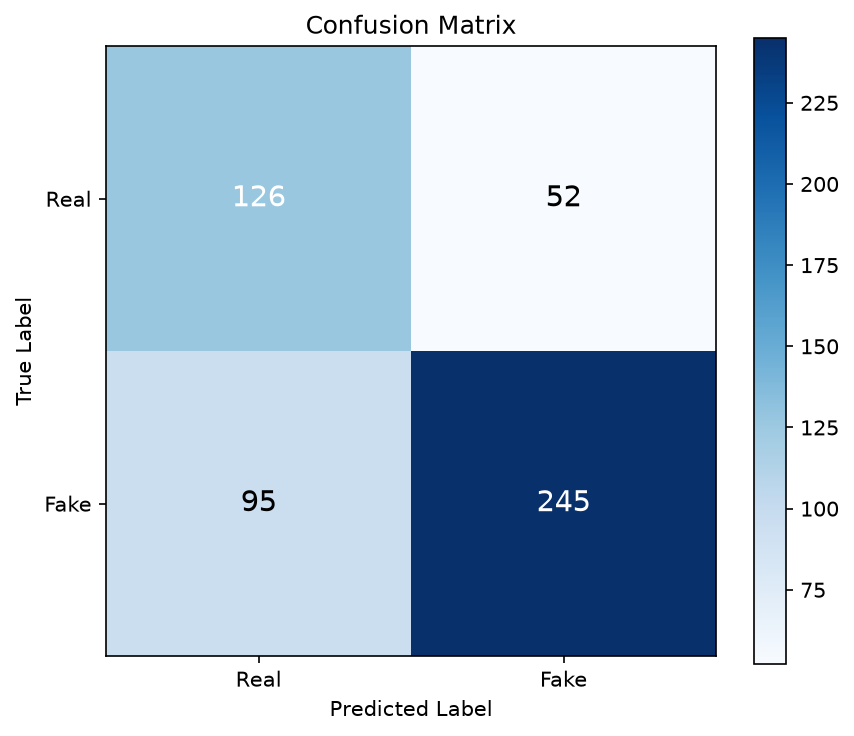
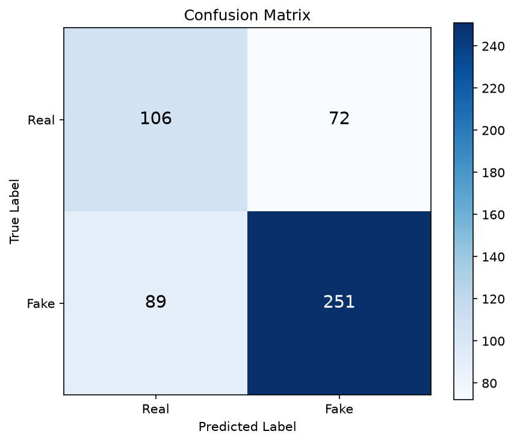
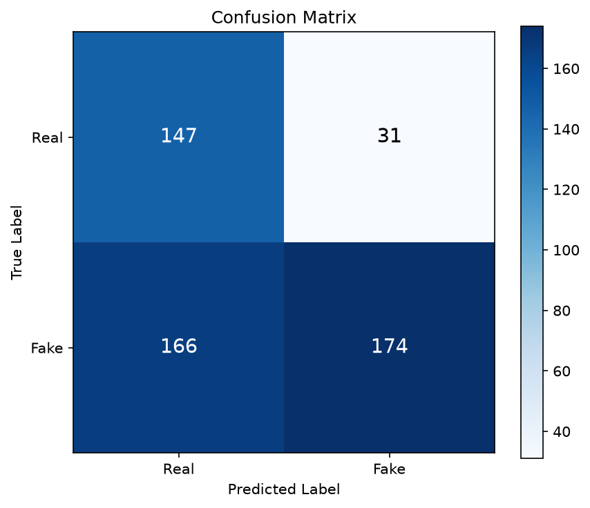

# Generalizability of CNN-Based Deepfake Image Detection

## Approach 4: Cross-manipulation and cross-dataset generalizability

### Full-versus-LOO evaluation

The full-versus-LOO evaluation compares the baseline CNN detectors trained on all four FaceForensics++ manipulation categories with Leave-One-Manipulation-Out (LOO) detectors trained without one manipulation category. For each held-out category, the LOO model is evaluated on the corresponding held-out manipulation alongside the Real samples in the test set. Results are compared with the matching baseline model and random seed.

The evaluation covers four held-out manipulation categories, three CNN architectures (EfficientNet-B0, ResNet50, and Xception), and three random seeds (42, 123, and 2024). This gives 36 matched baseline-LOO comparisons. The reported results use video-level metrics. Values in Table X are the mean and standard deviation across the three seeds for each holdout-model combination.

The paired difference for a metric is calculated as:

**Delta M = LOO metric - baseline metric**

A negative difference indicates that the LOO model obtained a lower score than its matched baseline. The standard deviation of the paired differences describes how much the observed change varies across the three seeds.

### Results

**Table X. Video-level baseline and LOO performance by held-out manipulation and model.** Values are mean ± standard deviation across three seeds. Delta values are calculated as LOO minus baseline.

| Held-out manipulation | Model | Baseline F1 | LOO F1 | Δ F1 | Δ ROC-AUC |
|---|---|---:|---:|---:|---:|
| Deepfakes | EfficientNet-B0 | 0.834 ± 0.072 | 0.767 ± 0.088 | -0.067 ± 0.087 | -0.090 ± 0.070 |
| Deepfakes | ResNet50 | 0.906 ± 0.056 | 0.732 ± 0.135 | -0.174 ± 0.190 | -0.081 ± 0.040 |
| Deepfakes | Xception | 0.887 ± 0.061 | 0.691 ± 0.117 | -0.196 ± 0.137 | -0.037 ± 0.063 |
| Face2Face | EfficientNet-B0 | 0.863 ± 0.112 | 0.429 ± 0.132 | -0.435 ± 0.240 | -0.236 ± 0.079 |
| Face2Face | ResNet50 | 0.950 ± 0.056 | 0.784 ± 0.034 | -0.166 ± 0.024 | -0.102 ± 0.056 |
| Face2Face | Xception | 0.963 ± 0.064 | 0.782 ± 0.019 | -0.181 ± 0.068 | -0.120 ± 0.021 |
| FaceSwap | EfficientNet-B0 | 0.878 ± 0.088 | 0.268 ± 0.057 | -0.610 ± 0.054 | -0.428 ± 0.045 |
| FaceSwap | ResNet50 | 0.921 ± 0.034 | 0.147 ± 0.006 | -0.774 ± 0.039 | -0.495 ± 0.014 |
| FaceSwap | Xception | 0.963 ± 0.064 | 0.140 ± 0.134 | -0.823 ± 0.080 | -0.569 ± 0.054 |
| NeuralTextures | EfficientNet-B0 | 0.819 ± 0.090 | 0.396 ± 0.122 | -0.423 ± 0.182 | -0.287 ± 0.076 |
| NeuralTextures | ResNet50 | 0.872 ± 0.016 | 0.232 ± 0.078 | -0.640 ± 0.093 | -0.370 ± 0.053 |
| NeuralTextures | Xception | 0.904 ± 0.055 | 0.226 ± 0.074 | -0.678 ± 0.128 | -0.398 ± 0.069 |

### Observations

The LOO models obtained lower mean F1-scores than their matched baselines in all 12 holdout-model combinations. The size of the difference varied by held-out manipulation and architecture. For Deepfakes, the mean F1 reduction ranged from 0.067 for EfficientNet-B0 to 0.196 for Xception. For Face2Face, the reductions ranged from 0.166 to 0.435. The largest F1 reductions occurred when FaceSwap was held out, with decreases ranging from 0.610 to 0.823. NeuralTextures holdouts also showed substantial reductions, ranging from 0.423 to 0.678.

The ROC-AUC differences followed a similar pattern. The smallest mean ROC-AUC reduction was observed for Xception when Deepfakes was held out (-0.037). The largest reduction was observed for Xception when FaceSwap was held out (-0.569). For all three architectures, holding out FaceSwap produced the largest mean decrease in both F1-score and ROC-AUC among the four manipulation categories.

Seed-level variation differed across combinations. The standard deviation of the paired F1 differences was relatively high for Face2Face with EfficientNet-B0 (0.240), Deepfakes with ResNet50 (0.190), and NeuralTextures with EfficientNet-B0 (0.182). In comparison, the paired F1 difference for Face2Face with ResNet50 had a standard deviation of 0.024. These variations indicate that the mean change alone does not fully describe the results, and the seed-level values should be retained alongside the aggregated statistics.

Overall, the measured results show that performance on the held-out manipulation was lower for the LOO models than for the corresponding full-category baselines. The magnitude of this difference was not uniform across manipulation categories or architectures. Since each holdout-model combination was evaluated with three seeds, these results are reported descriptively; they do not establish statistical significance or identify the mechanism responsible for the observed performance differences.

---

## Cross-dataset testing on Celeb-DF

### Objective and evaluation protocol

This experiment evaluates how the Approach 1 CNN checkpoints trained on FaceForensics++ C23 perform on the separate Celeb-DF dataset. The models are evaluated without target-dataset fine-tuning or threshold selection. This provides a cross-dataset test of the trained detectors, distinct from the full-versus-LOO cross-manipulation experiment above.

The processed Celeb-DF test manifest contains 49,732 frames from 518 videos: 340 manipulated (Fake) and 178 authentic (Real). Nine full-training checkpoints were evaluated: Xception, EfficientNet-B0, and ResNet50, each trained with seeds 42, 123, and 2024. The LOMO/LOO checkpoints were not used for this cross-dataset test.

Frame-level sigmoid probabilities were aggregated by the mean probability per video. The reported video-level metrics use a fixed threshold of 0.5. The evaluation retained the same inference pipeline and preprocessing configuration used for the baseline models.

### Results

**Table Y. Video-level Celeb-DF cross-dataset metrics using mean probability aggregation.** Each row represents one trained checkpoint evaluated on the same test manifest.

| Model | Seed | Accuracy | Precision | Recall | F1-score | ROC-AUC |
|---|---:|---:|---:|---:|---:|---:|
| Xception | 42 | 0.7162 | 0.8249 | 0.7206 | 0.7692 | 0.7950 |
| Xception | 123 | 0.7375 | 0.8054 | 0.7912 | 0.7982 | 0.7880 |
| Xception | 2024 | 0.7452 | 0.7385 | 0.9471 | 0.8299 | 0.8145 |
| EfficientNet-B0 | 42 | 0.6892 | 0.7771 | 0.7382 | 0.7572 | 0.7479 |
| EfficientNet-B0 | 123 | 0.7606 | 0.7673 | 0.9118 | 0.8333 | 0.7613 |
| EfficientNet-B0 | 2024 | 0.7259 | 0.7605 | 0.8500 | 0.8028 | 0.7545 |
| ResNet50 | 42 | 0.6197 | 0.8488 | 0.5118 | 0.6385 | 0.7612 |
| ResNet50 | 123 | 0.7529 | 0.7454 | 0.9471 | 0.8342 | 0.8215 |
| ResNet50 | 2024 | 0.7394 | 0.7556 | 0.8912 | 0.8178 | 0.7675 |

### Result figures

The following confusion matrices show the video-level mean-aggregation predictions for seed 42, one checkpoint per architecture. They are examples of the run-level outputs; the table above reports all nine runs.

**Figure Y1. Xception, seed 42, Celeb-DF video-level confusion matrix.**

**Figure Y2. EfficientNet-B0, seed 42, Celeb-DF video-level confusion matrix.**

**Figure Y3. ResNet50, seed 42, Celeb-DF video-level mean aggregation confusion matrix.**

### Observations and limitations

Across the nine evaluated checkpoints, video-level accuracy ranged from 0.6197 to 0.7606, F1-score ranged from 0.6385 to 0.8342, and ROC-AUC ranged from 0.7479 to 0.8215. Results varied across seeds within each architecture. For example, ResNet50 accuracy ranged from 0.6197 to 0.7529, while its recall ranged from 0.5118 to 0.9471. Therefore, individual checkpoint results should be read alongside the seed variation rather than treated as a single architecture-level outcome.

These measurements describe performance on the processed Celeb-DF test manifest used in this experiment. They do not establish performance on all Celeb-DF videos or on other unseen datasets. The cross-dataset results also should not be interpreted as a direct controlled comparison with the LOO holdout scores above, because the two experiments use different evaluation populations and test conditions.

### Output artifacts

The per-checkpoint output folders are organized under `data/output/cross_dataset_celebdf/`, with subfolders for each architecture and seed. Each run stores frame predictions, video predictions for mean/median/mode aggregation, metrics in JSON, ROC data, confusion-matrix plots, and an ROC curve plot. The evaluator script is `scripts/evaluate_celebdf_cross_dataset.py`.
