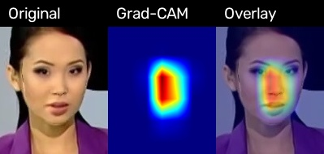
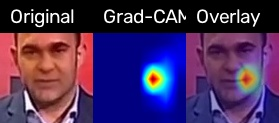
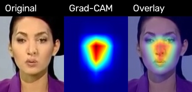
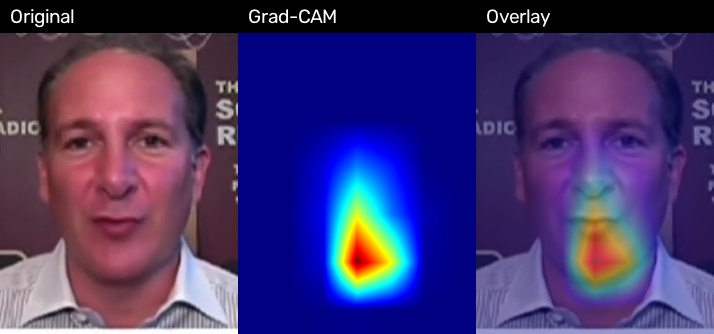

# Generalizability of CNN-Based Deepfake Image Detection

## Approach 4: Cross-manipulation and cross-dataset generalizability

### Full-versus-LOO evaluation

The full-versus-LOO evaluation compares the baseline CNN detectors trained on all four FaceForensics++ manipulation categories with Leave-One-Manipulation-Out (LOO) detectors trained without one manipulation category. For each held-out category, the LOO model is evaluated on the corresponding held-out manipulation alongside the Real samples in the test set. Results are compared with the matching baseline model and random seed.

The evaluation covers four held-out manipulation categories, three CNN architectures (EfficientNet-B0, ResNet50, and Xception), and three random seeds (42, 123, and 2024). This gives 36 matched baseline-LOO comparisons. The reported results use video-level metrics. Values in Table X are the mean and standard deviation across the three seeds for each holdout-model combination.

The paired difference for a metric is calculated as:

**Delta M = LOO metric - baseline metric**

A negative difference indicates that the LOO model obtained a lower score than its matched baseline. The standard deviation of the paired differences describes how much the observed change varies across the three seeds.

### Results

**Table X. Video-level baseline and LOO performance by held-out manipulation and model.** Values are mean ± standard deviation across three seeds. Delta values are calculated as LOO minus baseline.

| Held-out manipulation | Model | Baseline F1 | LOO F1 | Δ F1 | Δ ROC-AUC |
|---|---|---:|---:|---:|---:|
| Deepfakes | EfficientNet-B0 | 0.834 ± 0.072 | 0.767 ± 0.088 | -0.067 ± 0.087 | -0.090 ± 0.070 |
| Deepfakes | ResNet50 | 0.906 ± 0.056 | 0.732 ± 0.135 | -0.174 ± 0.190 | -0.081 ± 0.040 |
| Deepfakes | Xception | 0.887 ± 0.061 | 0.691 ± 0.117 | -0.196 ± 0.137 | -0.037 ± 0.063 |
| Face2Face | EfficientNet-B0 | 0.863 ± 0.112 | 0.429 ± 0.132 | -0.435 ± 0.240 | -0.236 ± 0.079 |
| Face2Face | ResNet50 | 0.950 ± 0.056 | 0.784 ± 0.034 | -0.166 ± 0.024 | -0.102 ± 0.056 |
| Face2Face | Xception | 0.963 ± 0.064 | 0.782 ± 0.019 | -0.181 ± 0.068 | -0.120 ± 0.021 |
| FaceSwap | EfficientNet-B0 | 0.878 ± 0.088 | 0.268 ± 0.057 | -0.610 ± 0.054 | -0.428 ± 0.045 |
| FaceSwap | ResNet50 | 0.921 ± 0.034 | 0.147 ± 0.006 | -0.774 ± 0.039 | -0.495 ± 0.014 |
| FaceSwap | Xception | 0.963 ± 0.064 | 0.140 ± 0.134 | -0.823 ± 0.080 | -0.569 ± 0.054 |
| NeuralTextures | EfficientNet-B0 | 0.819 ± 0.090 | 0.396 ± 0.122 | -0.423 ± 0.182 | -0.287 ± 0.076 |
| NeuralTextures | ResNet50 | 0.872 ± 0.016 | 0.232 ± 0.078 | -0.640 ± 0.093 | -0.370 ± 0.053 |
| NeuralTextures | Xception | 0.904 ± 0.055 | 0.226 ± 0.074 | -0.678 ± 0.128 | -0.398 ± 0.069 |

### Observations

The LOO models obtained lower mean F1-scores than their matched baselines in all 12 holdout-model combinations. The size of the difference varied by held-out manipulation and architecture. For Deepfakes, the mean F1 reduction ranged from 0.067 for EfficientNet-B0 to 0.196 for Xception. For Face2Face, the reductions ranged from 0.166 to 0.435. The largest F1 reductions occurred when FaceSwap was held out, with decreases ranging from 0.610 to 0.823. NeuralTextures holdouts also showed substantial reductions, ranging from 0.423 to 0.678.

The ROC-AUC differences followed a similar pattern. The smallest mean ROC-AUC reduction was observed for Xception when Deepfakes was held out (-0.037). The largest reduction was observed for Xception when FaceSwap was held out (-0.569). For all three architectures, holding out FaceSwap produced the largest mean decrease in both F1-score and ROC-AUC among the four manipulation categories.

Seed-level variation differed across combinations. The standard deviation of the paired F1 differences was relatively high for Face2Face with EfficientNet-B0 (0.240), Deepfakes with ResNet50 (0.190), and NeuralTextures with EfficientNet-B0 (0.182). In comparison, the paired F1 difference for Face2Face with ResNet50 had a standard deviation of 0.024. These variations indicate that the mean change alone does not fully describe the results, and the seed-level values should be retained alongside the aggregated statistics.

Overall, the measured results show that performance on the held-out manipulation was lower for the LOO models than for the corresponding full-category baselines. The magnitude of this difference was not uniform across manipulation categories or architectures. Since each holdout-model combination was evaluated with three seeds, these results are reported descriptively; they do not establish statistical significance or identify the mechanism responsible for the observed performance differences.

---

## Cross-dataset testing on Celeb-DF

### Objective and evaluation protocol

This experiment evaluates how the Approach 1 CNN checkpoints trained on FaceForensics++ C23 perform on the separate Celeb-DF dataset. The models are evaluated without target-dataset fine-tuning or threshold selection. This provides a cross-dataset test of the trained detectors, distinct from the full-versus-LOO cross-manipulation experiment above.

The processed Celeb-DF test manifest contains 49,732 frames from 518 videos: 340 manipulated (Fake) and 178 authentic (Real). Nine full-training checkpoints were evaluated: Xception, EfficientNet-B0, and ResNet50, each trained with seeds 42, 123, and 2024. The LOMO/LOO checkpoints were not used for this cross-dataset test.

Frame-level sigmoid probabilities were aggregated by the mean probability per video. The reported video-level metrics use a fixed threshold of 0.5. The evaluation retained the same inference pipeline and preprocessing configuration used for the baseline models.

### Results

**Table Y. Video-level Celeb-DF cross-dataset metrics using mean probability aggregation.** Each row represents one trained checkpoint evaluated on the same test manifest.

| Model | Seed | Accuracy | Precision | Recall | F1-score | ROC-AUC |
|---|---:|---:|---:|---:|---:|---:|
| Xception | 42 | 0.7162 | 0.8249 | 0.7206 | 0.7692 | 0.7950 |
| Xception | 123 | 0.7375 | 0.8054 | 0.7912 | 0.7982 | 0.7880 |
| Xception | 2024 | 0.7452 | 0.7385 | 0.9471 | 0.8299 | 0.8145 |
| EfficientNet-B0 | 42 | 0.6892 | 0.7771 | 0.7382 | 0.7572 | 0.7479 |
| EfficientNet-B0 | 123 | 0.7606 | 0.7673 | 0.9118 | 0.8333 | 0.7613 |
| EfficientNet-B0 | 2024 | 0.7259 | 0.7605 | 0.8500 | 0.8028 | 0.7545 |
| ResNet50 | 42 | 0.6197 | 0.8488 | 0.5118 | 0.6385 | 0.7612 |
| ResNet50 | 123 | 0.7529 | 0.7454 | 0.9471 | 0.8342 | 0.8215 |
| ResNet50 | 2024 | 0.7394 | 0.7556 | 0.8912 | 0.8178 | 0.7675 |

### Result figures

The following confusion matrices show the video-level mean-aggregation predictions for seed 42, one checkpoint per architecture. They are examples of the run-level outputs; the table above reports all nine runs.

**Figure Y1. Xception, seed 42, Celeb-DF video-level confusion matrix.**


**Figure Y2. EfficientNet-B0, seed 42, Celeb-DF video-level confusion matrix.**


**Figure Y3. ResNet50, seed 42, Celeb-DF video-level mean aggregation confusion matrix.**


### Observations and limitations

Across the nine evaluated checkpoints, video-level accuracy ranged from 0.6197 to 0.7606, F1-score ranged from 0.6385 to 0.8342, and ROC-AUC ranged from 0.7479 to 0.8215. Results varied across seeds within each architecture. For example, ResNet50 accuracy ranged from 0.6197 to 0.7529, while its recall ranged from 0.5118 to 0.9471. Therefore, individual checkpoint results should be read alongside the seed variation rather than treated as a single architecture-level outcome.

These measurements describe performance on the processed Celeb-DF test manifest used in this experiment. They do not establish performance on all Celeb-DF videos or on other unseen datasets. The cross-dataset results also should not be interpreted as a direct controlled comparison with the LOO holdout scores above, because the two experiments use different evaluation populations and test conditions.

### Output artifacts

The per-checkpoint output folders are organized under `data/output/cross_dataset_celebdf/`, with subfolders for each architecture and seed. Each run stores frame predictions, video predictions for mean/median/mode aggregation, metrics in JSON, ROC data, confusion-matrix plots, and an ROC curve plot. The evaluator script is `scripts/evaluate_celebdf_cross_dataset.py`.


---

## Grad-CAM under distribution shift

### Objective

This post-hoc visual analysis extends the Approach 4 generalizability experiments by inspecting the image regions emphasized by the trained CNNs when evaluated on manipulation categories seen during training and on a held-out manipulation category. Grad-CAM produces class-discriminative localization maps for individual images. Comparing these maps provides qualitative supporting evidence about model behavior under the LOMO distribution shift.

The visual analysis complements, but does not replace, the video-level classification metrics reported in the full-versus-LOO evaluation. A Grad-CAM heatmap indicates regions contributing to a model's selected prediction target; without comparison to aligned manipulation masks, it does not establish that the highlighted pixels correspond to the actual manipulated region.

### Evaluation design

The analysis used the same four-category LOMO structure: in each run, one manipulation category was excluded from training and treated as the unseen evaluation category. Samples from the other three manipulation categories formed the seen group. The script generated visualizations for the seen and unseen groups for each checkpoint configuration.

| Dimension | Setting |
|---|---|
| Held-out manipulation categories | Deepfakes, Face2Face, FaceSwap, NeuralTextures |
| Architectures | Xception, EfficientNet-B0, ResNet50 |
| Model-training seeds | 42, 123, 2024 |
| Configurations | 4 holdouts × 3 architectures × 3 seeds = 36 |
| Sampling per category in each configuration | 12 videos, one frame per video |
| Fixed sample-selection seed | 42 |
| Visualizations per configuration | 48: 36 seen samples (12 per seen category) and 12 unseen samples |
| Total generated visualization files | 36 × 48 = 1,728 |

The training seed identifies the checkpoint, while the fixed sample-selection seed controls example selection. They serve separate purposes and should not be conflated.

### Implementation and execution

The Approach 4-specific post-hoc visualization was implemented in `scripts/approach4_gradcam_shift.py` and executed for all 36 holdout-architecture-seed combinations. Each run saved its visualizations and accompanying CSV metadata under `data/output/approach4_gradcam_shift/`. The per-run directory structure is:

```text
data/output/approach4_gradcam_shift/
  holdout_<CATEGORY>_<MODEL>_seed<SEED>/
    gradcam_examples.csv
    sample_counts.csv
    visualizations/
      <sample-index>_<seen-or-unseen>_<category>_<video-ids>_frame<index>.jpg
```

The `gradcam_examples.csv` file records the per-example information associated with the generated maps, and `sample_counts.csv` records the sample counts. The visualization filenames encode the sample index, seen/unseen group, manipulation category, video identifiers, and selected frame index, allowing a report figure to be traced to its run output and metadata.

The run used 12 sampled videos per category and one frame per video, with sample-selection seed 42. The generated artifacts cover four held-out categories, three architectures, and three model-training seeds. This confirms that the planned Approach 4 visual generation and comparison was implemented and run. The saved artifacts establish completion of the qualitative visualization step; they do not, on their own, establish completion of quantitative mask-based explainability scoring.

### Suggested visual presentation and figure files

The report should use a few carefully selected examples in the main text and retain the full visualization set as supplementary material. Figures should be selected from the generated run folders, and captions should state the holdout category, model, training seed, group (seen or unseen), manipulation category, and frame/sample identifier. The examples below use the Deepfakes holdout, ResNet50, seed 42 run as a consistent illustrative configuration. Relative image paths point to the corresponding generated JPEGs.

**Figure Z1. Seen-category and held-out-category Grad-CAM examples for the Deepfakes LOMO holdout (ResNet50, seed 42).** The seen examples are from Face2Face and the held-out examples are from Deepfakes. These examples illustrate the visual comparison protocol for a single checkpoint configuration; they are not a category-level summary.





**Figure Z2. Seen-category examples across the three manipulation categories retained in the Deepfakes holdout run (ResNet50, seed 42).** This figure can be used to show the range of seen manipulation inputs under one fixed model and seed. Each image should be captioned with its category and frame identifier.





**Figure Z3. Held-out manipulation examples across the four LOMO conditions.** For a concise cross-condition overview, select one held-out sample from each of the four holdout folders, keeping architecture and seed fixed. The figure should use the same model architecture and seed for all panels and identify the exact source image for each panel. This comparison is intended to illustrate the experimental conditions, not to imply that the examples are matched across categories.

For the main report, Figure Z1 is the essential seen-versus-unseen comparison. Figure Z2 and Figure Z3 may be placed in an appendix if page space is limited. The complete set of generated maps is available in the per-run `visualizations/` folders. Use the original saved files and avoid image edits that could change the appearance or interpretation of the heatmaps.

### Interpretation and reporting boundaries

The visual comparison should be described at the level of the displayed examples. For each selected case, the text may describe where the heatmap appears concentrated and whether its spatial pattern looks similar or different from the paired seen/unseen examples. Such observations must be based on direct inspection of the corresponding image outputs. The mere presence of a heatmap, or its apparent concentration on a face, is not evidence that the model localized manipulated pixels correctly.

This experiment is qualitative and sample-based. Each configuration includes 12 sampled videos per category and one frame per video, so the maps are illustrative rather than an exhaustive examination of all evaluation frames. Observations from a small selection of examples should not be generalized to an entire manipulation category without systematic aggregation and analysis.

Approach 3 defines quantitative local explainability measures based on saliency overlap and regional IoU against ground-truth manipulated regions. The Approach 4 outputs documented here include generated visualization images and sample metadata, but do not include reported values for those mask-based metrics. Therefore, this section reports the Grad-CAM visualization comparison as implemented and run, while leaving quantitative mask-based evaluation unclaimed unless those calculations are separately performed and documented. Similarly, the figures do not independently measure explanation faithfulness or causal reliance on forgery artifacts.

### Reproducibility and artifact inventory

The experiment can be traced through the script, the run-specific folders, and their CSV files. To reproduce or audit a selected figure, use its relative path to identify the run directory, then consult that run's `gradcam_examples.csv` and `sample_counts.csv` records. Preserve the original filenames in the report or figure source notes so that the chosen examples can be located again.

The key outputs are:

- The 36 run directories, one for each held-out category, architecture, and training seed.
- The generated JPEG visualization files for the seen and unseen groups.
- Per-example metadata in `gradcam_examples.csv`.
- Per-run sampling information in `sample_counts.csv`.

The report's figure set should remain representative and compact. The full visualization inventory is more appropriate as supplementary evidence than as a sequence of all 1,728 images in the main body.
